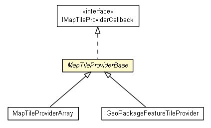
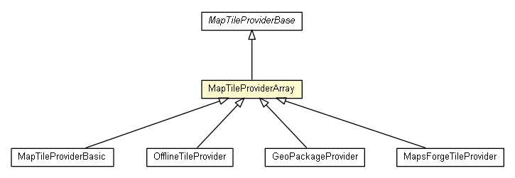
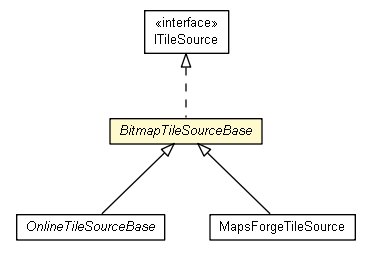
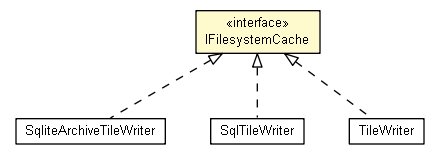

# Modular Tile Provider Architecture

Note: This article has a number of UML diagrams that were generated during the site generation process circa Oct 2017. They may be out of date or inaccurate. For the most up to date graphs, see the osmdroid javadocs.

## Introduction

osmdroid has a modular and extensible tile provider architecture that allows tiles to be provided from a number of sources including online sources, local archive sources, and file store sources.

## Top Level Tile Provider

The tile provider architecture begins with a top-level tile provider that manages calls to get tiles. There are two top-level tile providers provided for SDK users:

### MapTileProviderBasic (extends MapTileProviderArray)

This top-level tile provider implements a default tile request chain which includes a MapTileFilesystemProvider (a file-system cache), a MapTileFileArchiveProvider (provides tiles from archives) and a MapTileDownloader (downloads map tiles from HTTP server). It is designed to get you up and running quickly and requires very little set up.

### MapTileProviderArray (extends MapTileProviderBase)

This top-level tile provider allows an SDK user to provide an array of modular asynchronous tile providers to be used to obtain map tiles. When a tile is requested, the MapTileProviderArray first checks the MapTileCache (synchronously) and returns the tile if available. If not, then the tile request is sent asynchronously to each tile provider in the MapTileProviderArray until one of the providers can provide the tile or until the request fails due to no more providers to try.

## Tile Provider Modules

* The MapTileProviderArray is the basis for the modular tile architecture and is the "manager" class that handles calls to the tile provider modules. The provided tile provider modules available for use are:
* MapTileFilesystemProvider (extends MapTileModuleProviderBase) - Implements a file system cache and provides cached tiles. This functions as a tile provider by serving cached tiles. It also implements an !IFilesystemCacheProvider which can be used by other tile providers to register for file system cache access so they can put their tiles in the file system cache.
* MapTileFileArchiveProvider (extends MapTileFileStorageProviderBase) - This tile provider can provide tiles stored in a file archive.
* MapTileDownloader (extends MapTileModuleProviderBase) - The MapTileDownloader loads tiles from an HTTP server. It subscribes to a FilesystemCacheProvider if available and saves data in it.
 * MapTileApproximater (extends MapTileModuleProviderBase) - This module will attempt to fill in tile coverage gaps using available tile imagery at current zoom-1 to minimum zoom. This works by stretching and scaling the best resolution available tile with the goal of reducing the visibility of the gray grid.

## Tile Sources

Tile providers use tile sources classes to encapsulate information about the type of tiles the provider serves. A tile source also provides rendering services to create Drawables. Tile sources that provide raster images (bitmap, jpg, png, gif, etc...) can extend the BitmapTileSourceBase class. 

If the tile source is online (accessible via HTTP), then they can extend the OnlineTileSourceBase. OnlineTileSourceBase classes are the only tile sources that the MapTileDownloader can serve.

## Asynchronous Tile Request Chain Details

The asynchronous tile request chain works as such:

1. The tile request comes into the MapTileProviderArray.
2. The MapTileProviderArray checks the memory-cache.
3. If no hit, and no previous requests are pending for this tile, then fire off a request into the tile request pipeline.
4. The first tile provider module gets the request, and queues it where a TileLoader picks it up and tries to obtain the tile. If it can, it returns the tile as an InputStream to the MapTileProviderArray to signal "success". If it cannot, then it returns null to signal "failure". It also has the option of sending back a "candidate" tile. This means that a tile is provided that will be put into the tile cache, but the  MapTileProviderArray will continue to try other tile providers to get a better tile.
5. If the MapTileProviderArray gets a "failure" from the async provider, it gets the next async provider for this tile and passes the tile to that provider to be processed (back to #4). If there are no more tile providers left, then the tile request fails.

## File System Cache Model

To provide a universal file system cache for use to all providers, an IFilesystemCacheProvider is used. This can be used by tile providers if they wish to cache their tiles in a filesystem cache for quicker retrieval next time the tile is requested.

There are currently 3 implementions

 - TileWriter, used for API9 and older devices, stores files on the raw file system. This limitations and scaling issues. Cached content will expire over time.
 - SqlTileWriter, used for API10+ devices, this stores all tiles in a sqlite database. Cached content will expire over time.
 - SqlArchiveTileWriter, this writer produces osmdroid sqlite file archives which does not expire. This effectively provides a MOBAC like capability on device.

